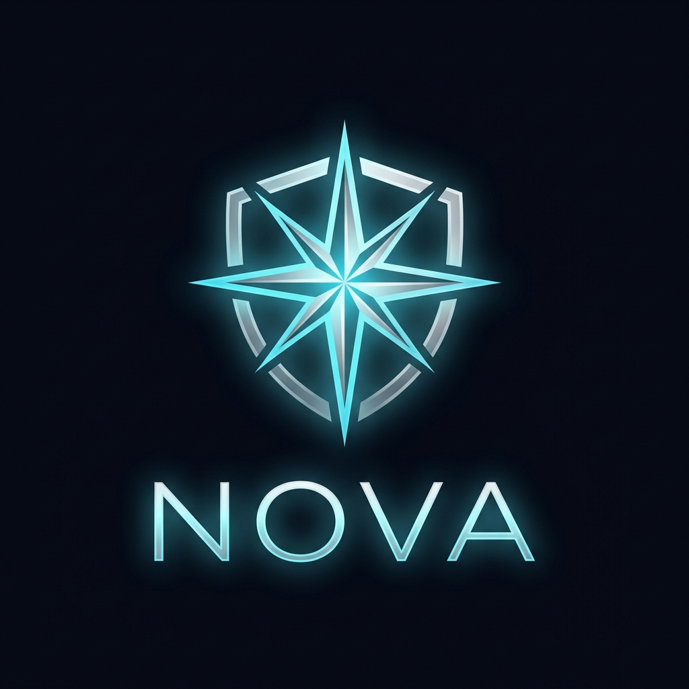

# 
Nova — Your Simple & Secure Private Vault

  

  <strong>The safest way to hide your secret notes, links, photos, and files right in your browser.</strong>

---

## 🌟 What is Nova?

**Nova** is a "digital safe" for your browser. It helps you keep private information away from prying eyes. The best part? It can hide itself as a **fully working calculator**, so nobody even knows your vault exists!

---

## ✨ Main Features

### 🔒 1. Super Strong Security
Everything you put in Nova is locked with a "Master Password." Nova uses advanced encryption (like a high-tech digital lock) to make sure only *you* can see your data.

### 🧮 2. The Calculator Trick (Disguise)
You can set Nova to look exactly like a normal calculator. 
- To others: It's just for math.
- To you: Type your secret code (PIN) and press `=`, and your hidden vault opens up!

### 📂 3. Store Anything
- **Secret Notes**: Keep private thoughts, passwords, or codes.
- **Private Links**: Save bookmarks you don't want in your main browser history.
- **Photos & Images**: A private gallery for your sensitive pictures.
- **PDF Documents**: Store important files and read them safely inside the app.

### 🎨 4. Beautiful & Easy to Use
Nova is designed to be dark, clean, and very fast. It doesn't take up much space on your screen and feels like a premium app.

---

## 📥 How to Install (Simple Steps)

1.  **Download** the Nova folder to your computer.
2.  Open **Google Chrome** and go to this address: `chrome://extensions/`
3.  Turn on **"Developer mode"** (look for a switch in the top-right corner).
4.  Click the button that says **"Load unpacked"**.
5.  Select the **Nova folder** you downloaded.
6.  That's it! Click the 🧩 icon in your browser to pin Nova for easy access.

---

## 📖 How to Use Nova

### First Time Setup
When you open Nova for the first time, it will ask you to create a **Master Password**. 
*   **Important:** Choose a password you will remember. If you lose this, Nova cannot recover your data!

### Using the Calculator Mode
1.  Open Nova and go to **Settings** (the gear ⚙️ icon).
2.  Turn on **"Disguise Mode"**.
3.  Set a **Secret PIN** (like `1234`).
4.  Now, every time you open the app, it will be a calculator. Just type your PIN and press `=` to enter your vault.

### Adding & Viewing Items
- Use the icons at the top to switch between Notes, Links, Images, and Docs.
- Click the **(+) button** to add something new.
- Click **View** to see an item, or the **Trash bin** 🗑️ icon to delete it.

---

## 💾 Backup & Restore (Very Important)

Because Nova keeps your data **only on your computer**, you should make backups to keep your information safe forever.

### How to Backup (Export)
1.  Open Nova and click the **Settings** (⚙️) icon.
2.  Click the **Export** button.
3.  Nova will save a file (like `nova-backup.json`) to your computer. 
4.  **Keep this file safe!** You can put it on a USB drive or in a private cloud folder.

### How to Recover (Import)
1.  If you get a new computer or re-install the extension, open Nova.
2.  Go to **Settings** and click **Import**.
3.  Select the backup file you saved earlier.
4.  Nova will ask for your **Master Password** to unlock the file.
5.  All your secret notes and files will be back!

---

## ⚠️ Important Things to Know (Safety Tips)

- **Where is my data?** Your data is stored **only on your computer**. It is NOT sent to the internet. This makes it very safe, but it also means...
- **Don't lose your password!** Because we don't have your data on our servers, we cannot reset your password if you forget it.
- **Back it up!** In the Settings, use the **Export** button to save a "backup file" once in a while. If you ever delete Chrome or get a new PC, you can use this file to get your data back.

---

## 📄 License
Nova is free to use under the MIT License. Your privacy is our priority!

---

  Stay safe and keep your secrets private with Nova. 🛡️

